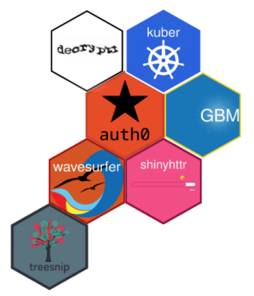
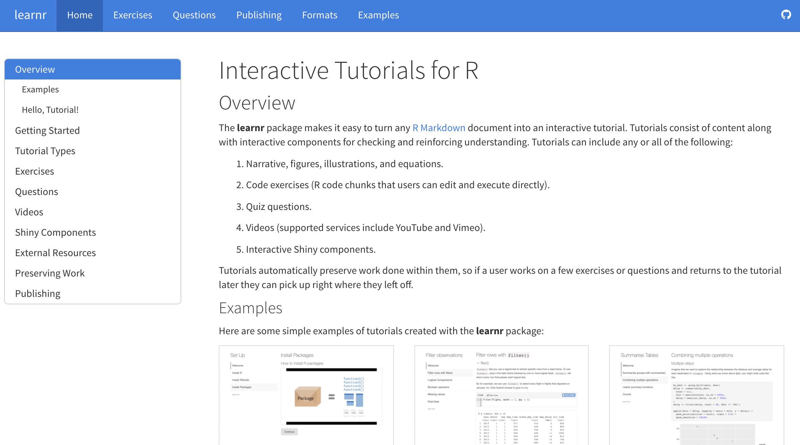
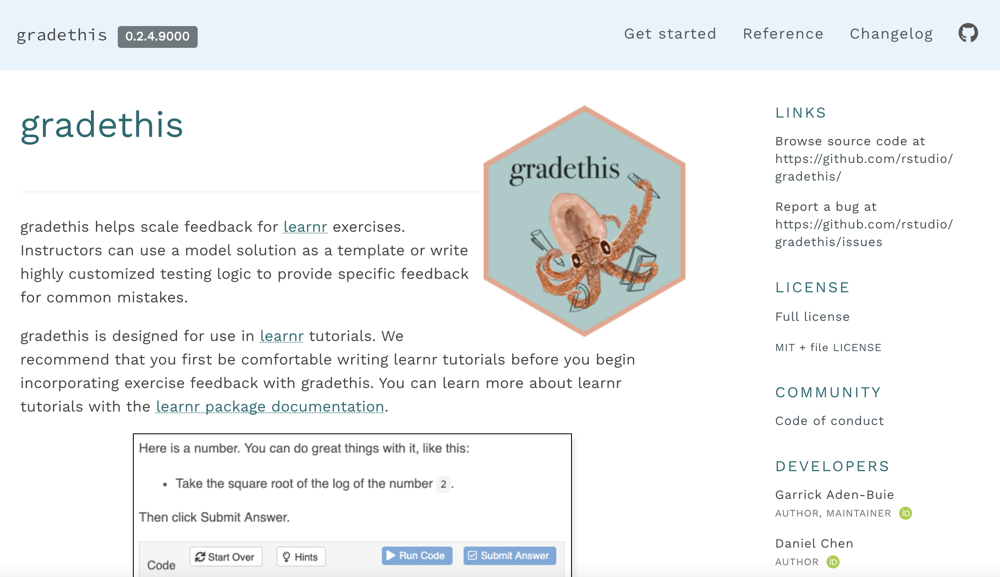
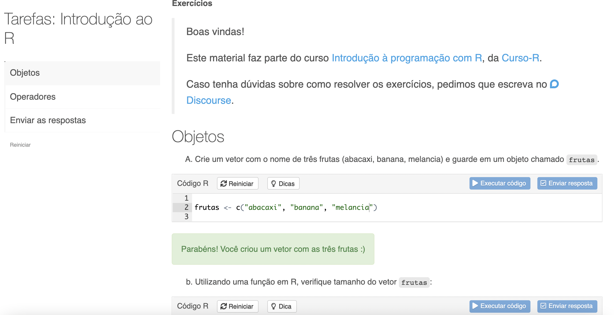
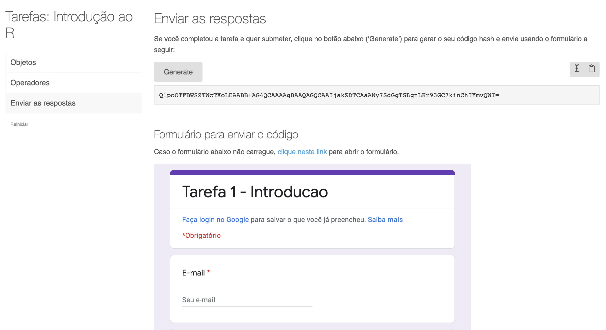
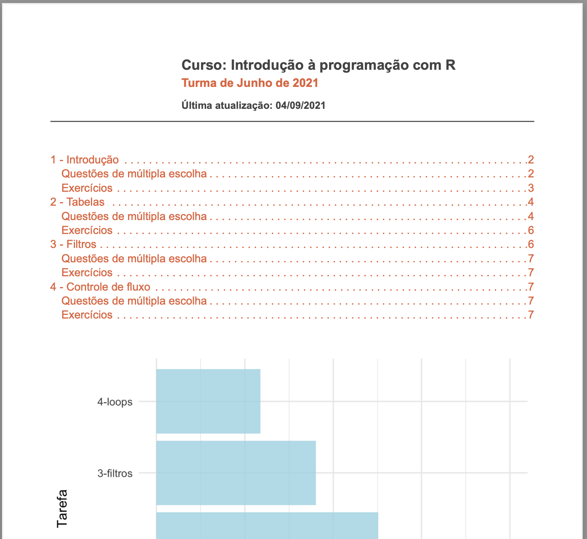
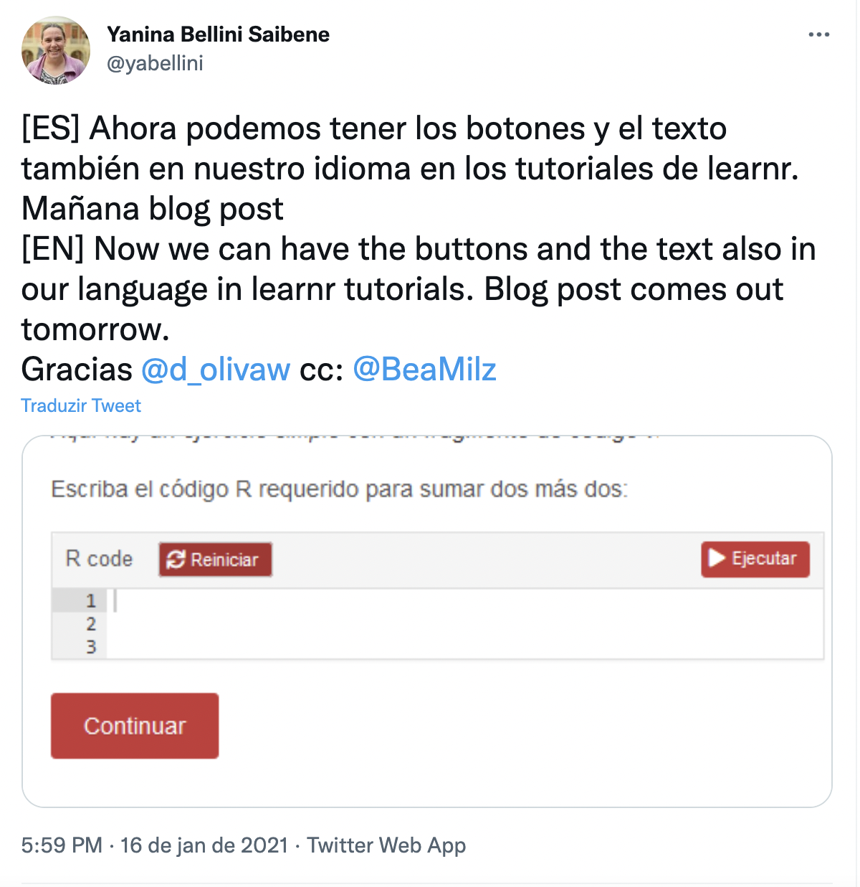

```{r setup, include=FALSE}
`%>%` <- magrittr::`%>%`

colorido <- function(x, cor = "#6495ed") {
  glue::glue(
    '<span style="color:{cor}; font-weight: bold;">{x}</span>'
  ) %>% 
    htmltools::HTML()
}

options(width = 85)

knitr::opts_chunk$set(eval = TRUE, echo = TRUE, comment = "#>", fig.align = "center")

#install.packages('bibtex')
library(RefManageR)
BibOptions(check.entries = FALSE,
           bib.style = "authoryear",
           cite.style = "alphabetic",
           style = "markdown",
           hyperlink = FALSE,
           dashed = FALSE)

myBib <- ReadBib("./packages.bib", check = FALSE)
```

.pull-left[
## <a href='https://curso-r.com'> Fernando Correa 📌</a>

```{r, echo=FALSE, out.width="30%", fig.align='center'}

```


Master student at the Institute of Mathematics and Statistics - University of São Paulo. 

Teacher at [Curso-R](https://curso-r.com/).


]

.pull-right[
## <a href='https://linktr.ee/beamilz'> Beatriz Milz    📌</a>

```{r, echo=FALSE, out.width="30%", fig.align='center'}
knitr::include_graphics("img/bea.jpg")
```

PhD Candidate in Environmental Sciences - Institute of Energy and Environment - University of São Paulo. 

[R-Ladies São Paulo](https://www.meetup.com/R-Ladies-Sao-Paulo/) Co-organizer. [Certified tidyverse instructor by RStudio](https://education.rstudio.com/trainers/people/milz+beatriz/).
Teacher at [Curso-R](https://curso-r.com/).

]

---

.pull-left[

## Curso-R

- [+ 15 R courses](https://curso-r.com/)

- [Blog (since 2017)](https://blog.curso-r.com/)

- [Discourse](https://discourse.curso-r.com/)

- [Free, online and open materials](https://curso-r.com/material/)

- [Free online book on R and Data Science](https://livro.curso-r.com/)

- [Youtube channel](https://www.youtube.com/c/CursoR6) (around 70 videos);


]


.pull-right[

<br>
- [R packages](https://curso-r.com/produtos/):
```{r, echo=FALSE, out.width="80%"}

```

]

---

## Introduction

- In person courses:
  - March 2020 - had to be changed into an online approach due to the COVID-19 pandemic. 
  
  - Increasing number of participants.

- Homework assignments:
  - Time-consuming to check and give feedback 
  - It's hard to give timely feedback.
  
  
- What we wanted...


  
  
???
Several learning activities that were performed in person had to be changed into an online approach due to the COVID-19 pandemic. Several people that otherwise could not attend an in-person activity were able to join in the online activities. 


The increasing number of participants presents challenges, and the one we approach in this article is checking and giving feedback to homework assignments in R courses.


Checking and giving feedback to homework assignments usually are time-consuming activities, and as such, they might make it harder to give timely feedback.  

???
In this course, we adopted interactive online homework assignments to provide formative assessment after each class. The process of reviewing and evaluating whether the students could answer the exercises correctly enabled instructors and students to qualify the understanding of contents discussed in class. Feedbacks and answers were steadily available while students answered to the assignments.

---

.pull-left[
## Package [learnr](https://rstudio.github.io/learnr/)

- by RStudio

<a href='https://rstudio.github.io/learnr/'>
```{r echo=FALSE, out.width="100%"}

```
</a>

]

.pull-right[

## Package [gradethis](https://pkgs.rstudio.com/gradethis/) 

- also by RStudio

<a href='https://pkgs.rstudio.com/gradethis/'>
```{r echo=FALSE, out.width="100%"}

```
</a>
]

---

.pull-left[

## Asked on twitter:
<a href='https://twitter.com/BeaMilz/status/1375544221847990277?s=20'>
```{r echo=FALSE, out.width="100%"}
knitr::include_graphics("img/tweet1.png")
```
</a>


> "Can the students submit their responses so the teachers can see their answers?"
]

--

.pull-right[


<br><br>

<a href='https://twitter.com/yabellini/status/1375544979699949568?s=20'>
```{r echo=FALSE, out.width="100%"}

```
</a>
]

---

## Mine's talk

- [Mine Çetinkaya-Rundel](https://twitter.com/minebocek)'s  talk at the [RStudio Global Conference 2021](https://www.rstudio.com/resources/rstudioglobal-2021/)

- She presented an approach for giving feedback at scale that is both meaningful and timely.


<a href='https://www.rstudio.com/resources/rstudioglobal-2021/feedback-at-scale/'>
```{r echo=FALSE, out.width="50%"}

```
</a>


---

## Our objectives

- We tried the approach presented in [Mine](https://twitter.com/minebocek)'s talk 

  - **Introduction to programming with R** course

  - June/2021 ~ 55 students; Set/2021 ~ 45 students


---

## What tools did we use?

.pull-left[
- Created the interactive tutorials (the homework) with package [learnr](https://rstudio.github.io/learnr/).

- Incorporating exercise feedback with the package [gradethis](https://pkgs.rstudio.com/gradethis/).

]

.pull-right[
<a href='https://acursor.shinyapps.io/intro-programacao_1-introducao/'>
```{r echo=FALSE, out.width="100%"}

```
</a>

]


---

## What tools did we use?

.pull-left[
- The package [learnrhash](https://github.com/rundel/learnrhash) was used to generate a compressed text-based representation of the answers (called *hash*), that students could copy and paste to submit their answers to the exercises.


- At the end of each homework, each student could send information such as their names, emails, and the hash code created by [learnrhash](https://github.com/rundel/learnrhash) through [Google Forms](https://www.google.com/intl/pt-BR/forms/about/).

]

.pull-right[
<a href='https://acursor.shinyapps.io/intro-programacao_1-introducao/'>
```{r echo=FALSE, out.width="100%"}

```
</a>
]

???

We structured our homework assignments using a blend of R packages to enable interactivity, steadily available feedbacks, and scalable review of several assignments. For the interactivity part, we used the package [learnr](https://rstudio.github.io/learnr/) `r Citep(myBib, 6)` , a tool that enables the creation of interactive tutorials by using R Markdown documents `r Citep(myBib, 2)` and Shiny Apps `r Citep(myBib, 4)`.
The package {gradethis} `r Citep(myBib, 1)` was designed to be used in {learnr} tutorials and was used to incorporate steadily available exercise feedback. The package {learnrhash} `r Citep(myBib, 5)` was used to generate a compressed text-based representation of the answers (called *hash*), that students could copy and paste to submit their answers to the exercises. At the end of each homework, each student could send information such as their names, emails, and the hash code created by learnrhash through Google Forms.


---


## What tools did we use?

.pull-left[
- We use the package package [googlesheets4](https://googlesheets4.tidyverse.org/) to import the answers sent by the students through Google Forms.

- We developed a reproducible report to present the results of homework assignments using [R Markdown](https://rmarkdown.rstudio.com/) and the package [pagedown](https://pagedown.rbind.io/). 
]

.pull-right[

```{r echo=FALSE, out.width="100%"}

```


]

???


By using the package {googlesheets4} `r Citep(myBib, 3)`, we were able to import the answers sent by the students through Google Forms. We developed a reproducible report to present the results of homework assignments using R Markdown and the package {pagedown} `r Citep(myBib, 5)`. Two examples of the information presented in the report were the percentage of students that submitted their answers through Google Forms and the percentage of students that answered to each exercise correctly. This report was designed to be used only by the instructors of the course.

 
We asked the students to answer the homework assignments before the following class, so the instructors could review the report and identify concepts that should be revised in class. At the beginning of each class, we reviewed the concepts that we identified when using the reproducible report, and we also solved the exercises in order to explain and answer any questions left.


---
## How can the students access the tutorials? 👩‍🏫


|Method|Example|Pros|Cons|
|---------|---------|---------|-------------|
|shinyapps.io|[shinyapps.io](https://www.shinyapps.io/)|  👩‍🏫 1. Straightforward deploy and user experience | 👩‍🎓 1. Require internet access <br> 👩‍🏫 2. Free tier has a limit of 80 hours/month. |
|R packages 📦|[CursoRTarefas](https://github.com/curso-r/CursoRTarefas) | 👩‍🎓1. Don't require internet access. <br> 👩‍🏫 2. Free. |  👩‍🏫 1. Learners must install an package from a remote source (e.g. github). <br> 3. **Documents are prone to encoding issues!** |


???
We also faced some challenges that we are still working on improving:
 
- Some of the students faced encoding errors when they used the tutorials directly in their RStudio sessions, when installing the package from GitHub.
 
- Considering that it is an introductory course, some of the students faced difficulties installing the package from GitHub. We had to help each one of them to install it by using Zoom share screen feature, and talking through the installation problems.


---
## Challenges

- [learnr](https://rstudio.github.io/learnr/) interactive document is not the same environment in which usual R programming happens. Learners might not realize how to apply their knowledge on longer codes.

 
- The packages **[learnr](https://rstudio.github.io/learnr/)**, **[gradethis](https://pkgs.rstudio.com/gradethis/)** and **[learnrhash](https://github.com/rundel/learnrhash)** were designed in English; therefore, all the messages, buttons, and other words are written in English. 

### [learnr](https://rstudio.github.io/learnr/)

  - The maintainers of the package [learnr](https://rstudio.github.io/learnr/) are making great efforts to support additional languages in the tutorials, and part of the interface already has support for it. 
    - Buttons an simple messages ✅-  [Contribution](https://github.com/rstudio/learnr/pull/488); 
    - Praises and encouragements 🍪 ✅  - [Suggestion](https://github.com/rstudio/learnr/issues/534) and [Contribution](https://github.com/rstudio/learnr/pull/551);
  

---

### [gradethis](https://pkgs.rstudio.com/gradethis/)

- Still 100% in English

- We made a fork of the package and translated the internal messages into Brazilian Portuguese, called [gradethisBR](https://github.com/curso-r/gradethis).

- [gradethisBR](https://github.com/curso-r/gradethis) is a temporary package and will be better if this feature is native in [gradethis](https://pkgs.rstudio.com/gradethis/) in the future. 


  
### [learnrhash](https://github.com/rundel/learnrhash)

- Still 100% in English, but there is only few words to translate.


---

## Final remarks


- We are aware of the remaining work to do in order to improve the support of additional languages in the learnr tutorials that use this approach. However, this is important to facilitate the use of [learnr](https://rstudio.github.io/learnr/) by more non-English speakers in forthcoming courses and classes. 

- We want to help improving [learnr](https://rstudio.github.io/learnr/)/[gradethis](https://pkgs.rstudio.com/gradethis/)/[learnrhash](https://github.com/rundel/learnrhash) to support additional languages as well, such as Brazilian Portuguese, Spanish and others.

---

## This is awesome not only for the Portuguese speaking community...


<a href='https://twitter.com/yabellini/status/1350548258620370947'>
```{r echo=FALSE, out.width="45%"}

```
</a>


---
class: middle


.pull-left[
## Acknowledgments

- [Curso-R](https://curso-r.com/)

- [Mine Çetinkaya-Rundel](https://twitter.com/minebocek)

- [Garrick](https://twitter.com/grrrck) + [RStudio](https://twitter.com/rstudio) + [learnr team](https://github.com/rstudio/learnr/blob/main/DESCRIPTION)

- [Yanina Bellini Saibene](https://twitter.com/yabellini)

- [Colin Rundel](https://twitter.com/rundel)
]

.pull-right[

## Thanks :)

Slides created via the R packages:

[**xaringan**](https://github.com/yihui/xaringan)<br>
[gadenbuie/xaringanthemer](https://github.com/gadenbuie/xaringanthemer)


The chakra comes from [remark.js](https://remarkjs.com), [**knitr**](http://yihui.name/knitr), and [R Markdown](https://rmarkdown.rstudio.com).


Twitter: [@BeaMilz](https://twitter.com/BeaMilz), [@Azeloc](https://twitter.com/Azeloc) and [@curso_r](https://twitter.com/curso_r)


]
 
<!-- inicio font awesome -->
<script src="https://kit.fontawesome.com/1f72d6921a.js" crossorigin="anonymous"></script>

<!-- final font awesome -->
```{r, include=FALSE}
# knitr::write_bib(c("learnr", "learnrhash", "gradethis", "googlesheets4", "rmarkdown", "pagedown" , "shiny", "CursoRTarefas"), 'packages.bib')
```

---
class: references


## References


```{r refs, echo=FALSE, results="asis"}
PrintBibliography(myBib, start = 1, end = 6)
```

