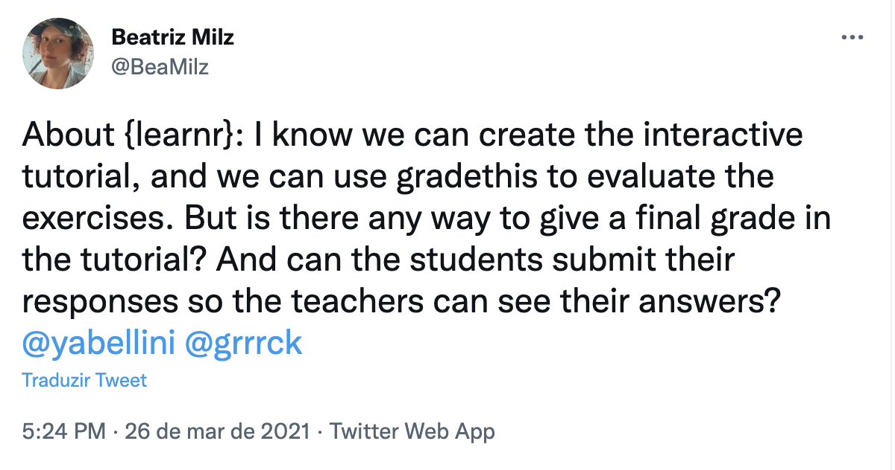

```{r setup, include=FALSE}
`%>%` <- magrittr::`%>%`

colorido <- function(x, cor = "#6495ed") {
  glue::glue(
    '<span style="color:{cor}; font-weight: bold;">{x}</span>'
  ) %>% 
    htmltools::HTML()
}

options(width = 85)

knitr::opts_chunk$set(eval = TRUE, echo = TRUE, comment = "#>", fig.align = "center")
```

.pull-left[
## <a href='https://curso-r.com'> Fernando Correa 📌</a>

```{r, echo=FALSE, out.width="30%", fig.align='center'}
knitr::include_graphics("img/fernando.webp")
```


Master student at the Institute of Mathematics and Statistics - University of São Paulo. 

Teacher at [Curso-R](https://curso-r.com/).


]

.pull-right[
## <a href='https://linktr.ee/beamilz'> Beatriz Milz    📌</a>

```{r, echo=FALSE, out.width="30%", fig.align='center'}
knitr::include_graphics("img/bea.jpg")
```

PhD Candidate in Environmental Siences - Institute of Energy and Environment - University of São Paulo. 

[R-Ladies São Paulo](https://www.meetup.com/R-Ladies-Sao-Paulo/) Co-organizer. [Certified tidyverse instructor by RStudio](https://education.rstudio.com/trainers/people/milz+beatriz/).
Teacher at [Curso-R](https://curso-r.com/).

]


---
class: middle, center

# Curso-R

.pull-left[

<br><br>
```{r, echo=FALSE, out.width="80%"}
knitr::include_graphics("https://d33wubrfki0l68.cloudfront.net/295643c6243701ae6a9bac3fb8ad467ff0ce3c84/d1785/img/logo/cursor1-41.png")
```

<br>
<br>


]

.pull-right[
```{r, echo=FALSE, out.width="80%"}
knitr::include_graphics("img/produtos.png")
```
]


---


Several learning activities that were performed in person had to be changed into an online approach due to the COVID-19 pandemic. Several people that otherwise could not attend an in-person activity were able to join in the online activities. 

- The increasing number of participants presents challenges

- Checking and giving feedback to homework assignments in R courses:
  - time-consuming
  - might make it harder to give timely feedback.


---

.pull-left[

## Asked on twitter:
<a href='https://twitter.com/BeaMilz/status/1375544221847990277?s=20'>
```{r echo=FALSE, out.width="100%"}

```
</a>
]

--

.pull-right[

<a href='https://twitter.com/yabellini/status/1375544979699949568?s=20'>
```{r echo=FALSE, out.width="100%"}
knitr::include_graphics("img/tweet1-answer.png")
```
</a>
]

---

Mine Cetinkaya-Rundel gave a talk at the RStudio Global Conference 2021, in which she presented an approach for giving feedback at scale that is both meaningful and timely [@cetinkaya-rundelFeedbackScale2021].


https://www.rstudio.com/resources/rstudioglobal-2021/feedback-at-scale/


---

 We tried this approach in an introduction to programming with R class with 50 students, and here we present the main strengths and challenges we have faced so far.

---
 
In this course, we adopted interactive online homework assignments to provide formative assessment after each class. The process of reviewing and evaluating whether the students could answer the exercises correctly enabled instructors and students to qualify the understanding of contents discussed in class. Feedbacks and answers were steadily available while students answered to the assignments.
 
---
We structured our homework assignments using a blend of R packages to enable interactivity, steadily available feedbacks, and scalable review of several assignments. For the interactivity part, we used the package {learnr} [@R-learnr], a tool that enables the creation of interactive tutorials by using R Markdown documents [@R-rmarkdown] and Shiny Apps [@R-shiny].
The package {gradethis} [@R-gradethis] was designed to be used in {learnr} tutorials and was used to incorporate steadily available exercise feedback. The package {learnrhash} [@R-learnrhash] was used to generate a compressed text-based representation of the answers (called *hash*), that students could copy and paste to submit their answers to the exercises. At the end of each homework, each student could send information such as their names, emails, and the hash code created by {learnrhash} [@R-learnrhash] through Google Forms.

---

By using the package {googlesheets4} [@R-googlesheets4], we were able to import the answers sent by the students through Google Forms. We developed a reproducible report to present the results of homework assignments using R Markdown [@R-rmarkdown] and the package {pagedown} [@R-pagedown]. Two examples of the information presented in the report were the percentage of students that submitted their answers through Google Forms and the percentage of students that answered to each exercise correctly. This report was designed to be used only by the instructors of the course.
 
We asked the students to answer the homework assignments before the following class, so the instructors could review the report and identify concepts that should be revised in class. At the beginning of each class, we reviewed the concepts that we identified when using the reproducible report, and we also solved the exercises in order to explain and answer any questions left.
 
---
Distributing the learnr tutorials at scale can be a challenge, so we provided three options for the students:
 
1. An R package to store the learnr tutorials, available on GitHub (https://github.com/);
 
2. A project in RStudio Cloud (https://rstudio.cloud/), with the package installed, so students could make a copy of the project and use it;
 
3. A deployed version in *Shinyapps.io* (https://www.shinyapps.io/) using a Starter Plan (which costs $9.00 per month + taxes).


---
## Como compartilhar um tutorial learnr? 👩‍🏫


|Forma|Exemplo|Vantagens| Desvantagens|
|---------|---------|---------|-------------|
|Fazendo o deploy do Shiny App|[shinyapps.io](https://www.shinyapps.io/)| 👩‍🎓1. Muito mais fácil para quem está aprendendo:  A pessoa aluna não precisa ter o R e o RStudio instalado para conseguir usar o tutorial <br> 👩‍🏫 2. Estudantes felizes, professoras felizes | 👩‍🎓 1. Precisa de acesso à internet <br> 👩‍🏫 2. A ferramenta gratuita tem limitação, dependendo da quantidade de pessoas alunas, será necessário pagar para que o serviço seja oferecido sem travamentos. |
|Adicionando em um pacote em R 📦|[CursoRTarefas](https://github.com/curso-r/CursoRTarefas) | 👩‍🎓1. Não precisa de acesso à internet <br> 👩‍🏫 2. Totalmente gratuito | 👩‍🎓1. Precisa ter o R e o RStudio instalados <br> 👩‍🏫 2. Precisa saber sobre Git, GitHub, Pacotes em R... <br> 3. **Possíveis problemas de encoding!** |

 
---
Some of the strengths that we found while using this approach are:
 
1. We have data that can help identifying the misunderstanding gaps that should be clarified or filled through revision of contents.
 
2. Although we spend some time before the course adapting the exercises from .R files to structured exercises in a learnr interactive tutorial, during the course we did not spend time correcting and giving feedback on the homework for each student.
 
3. We chose to create hints in the exercises, but did not show the solutions within the learnr tutorial. The students reacted positively to the possibility to see the hints, which were not possible to create when we used the .R files for the homework.


---
We also faced some challenges that we are still working on improving:
 
1. Some of the students faced encoding errors when they used the tutorials directly in their RStudio sessions, when installing the package from GitHub.
 
2. Considering that it is an introductory course, some of the students faced difficulties installing the package from GitHub. We had to help each one of them to install it by using Zoom share screen feature, and talking through the installation problems.
 
3. A {learnr} interactive document is not the same environment in which usual R programming happens, such as an IDE like RStudio or VSCode, and some learners might have a hard time understanding how they are related. Learners who can correctly answer homework assignments might not realize how to apply their knowledge on longer codes, such as R scripts.
 
4. The packages {learnr} [@R-learnr], {gradethis} [@R-gradethis] and {learnrhash} [@R-learnrhash] were designed in English; therefore, all the messages, buttons, and other words are written in English. The maintainers of the package {learnr} [@R-learnr] are making great efforts to support additional languages in the tutorials, and part of the interface already has support for it. Considering that this course is taught in Brazilian Portuguese, and the package {gradethis} [@R-gradethis] is still only available in English, we made a fork of the package and translated the internal messages into Brazilian Portuguese, called {gradethisBR}.


---
## learnrverse

- Nenhum dos pacotes está no CRAN por enquanto!


- Pacote [gradethis](https://github.com/rstudio/gradethis), mantido pela RStudio - [Documentação](https://pkgs.rstudio.com/gradethis/)

- Pacote [learnrhash](https://github.com/rundel/learnrhash), por Colin Rundel [](https://lifecycle.r-lib.org/articles/stages.html#experimental)

--

### Fluxo com learnrverse:

- Criar um tutorial com `learnr`
- `gradethis` ajuda com a avaliação dos exercícios
- `learnrhash` ajuda comprimindo as respostas em um texto hash
- Google formulários para coletar as respostas
- `googlesheets4` para importar as respostas para o R 
- Relatório final em RMarkdown: ajuda a identificar quais temas precisam ser revisados.


---
## learnr em português?

- Botões e mensagens básicas do learnr ✅-  [Contribuição](https://github.com/rstudio/learnr/pull/488)


- Mensagens de encoragamento e elogios 🍪 ✅  - [Sugestão](https://github.com/rstudio/learnr/issues/534) e  [contribuição](https://github.com/rstudio/learnr/pull/551)


### Próximos passos:

- Gradethis e learnrhash - ainda estão 100% em inglês

### Solução temporária:

Gradethis em Português: https://github.com/curso-r/gradethis (por [Fernando Corrêa](https://github.com/azeloc))


---

<a href='https://twitter.com/yabellini/status/1350548258620370947'>
```{r echo=FALSE, out.width="80%"}
knitr::include_graphics("img/tweet-yani-traducao.png")
```
</a>

 
--- 
We are aware of the remaining work to do in order to improve the support of additional languages in the learnr tutorials that use this approach. However, this is important to facilitate the use of learnr by more non-English speakers in forthcoming courses and classes. We understand that {gradethisBR} is a temporary package and will be better if this feature is native in {gradethis}. Thus, we want to help improving {gradethis} to support additional languages as well, such as Brazilian Portuguese, Spanish, German and others.

---
## Acknowledgments

- [Mine Çetinkaya-Rundel](https://twitter.com/minebocek)

- [Garrick](https://twitter.com/grrrck) + [RStudio](https://twitter.com/rstudio) + [LearnR team](https://github.com/rstudio/learnr/blob/main/DESCRIPTION)

- [Yanina Bellini Saibene](https://twitter.com/yabellini)

- [Colin Rundel](https://twitter.com/rundel)
---

<a href='https://twitter.com/BeaMilz/status/1352567469173583872?s=20'>
```{r echo=FALSE, out.width="80%"}

```
</a>

Translation: .....

---
class: center

## Thanks :)

.pull-left[
```{r echo=FALSE, fig.align='center', out.width="100%"}
knitr::include_graphics("https://media.giphy.com/media/M9NbzZjAcxq9jS9LZJ/giphy.gif")
```

]

.pull-right[

Slides created via the R packages:

[**xaringan**](https://github.com/yihui/xaringan)<br>
[gadenbuie/xaringanthemer](https://github.com/gadenbuie/xaringanthemer)


The chakra comes from [remark.js](https://remarkjs.com), [**knitr**](http://yihui.name/knitr), and [R Markdown](https://rmarkdown.rstudio.com).


]
 
<!-- inicio font awesome -->
<script src="https://kit.fontawesome.com/1f72d6921a.js" crossorigin="anonymous"></script>

<!-- final font awesome -->
```{r, include=FALSE}
# knitr::write_bib(c("learnr", "learnrhash", "gradethis", "googlesheets4", "rmarkdown", "pagedown" , "shiny", "CursoRTarefas"), 'packages.bib')
```
